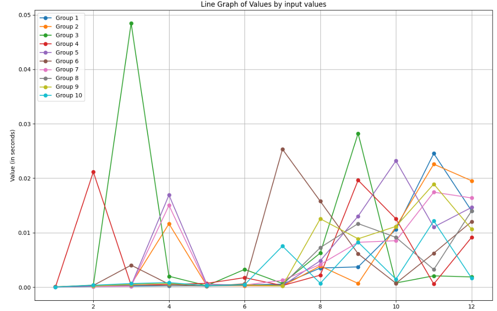
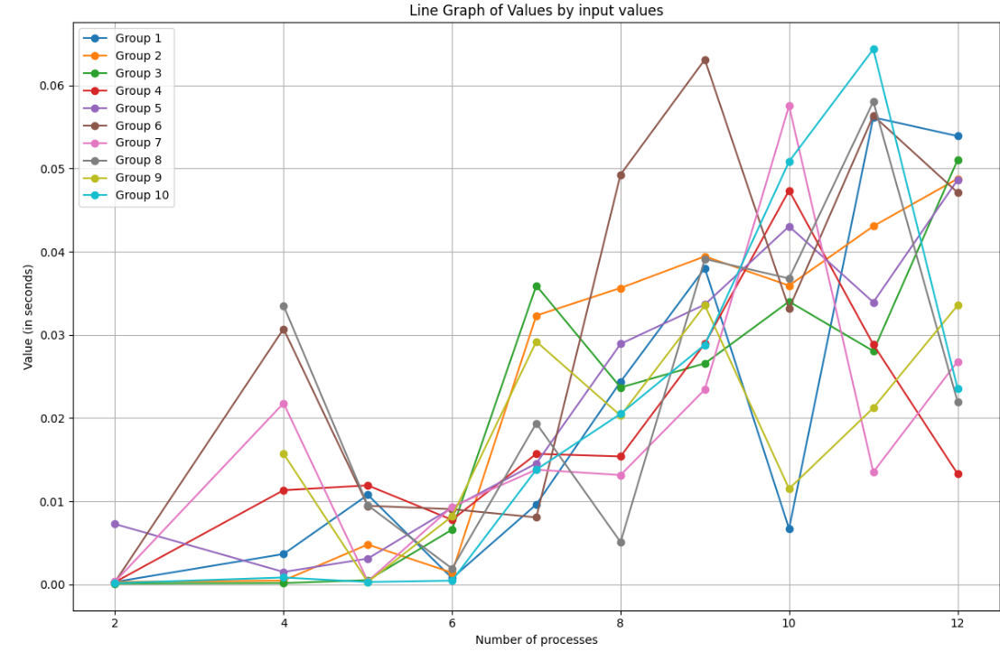
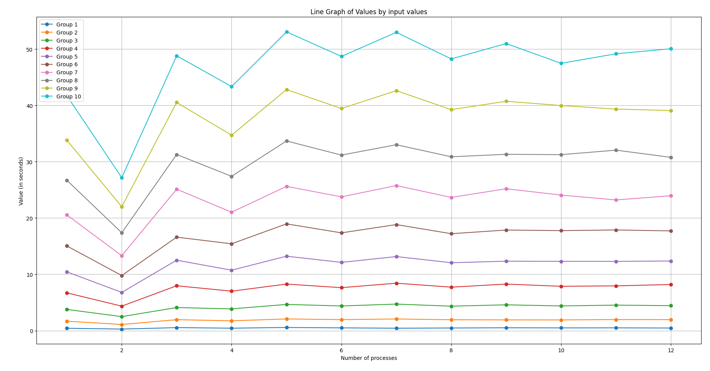
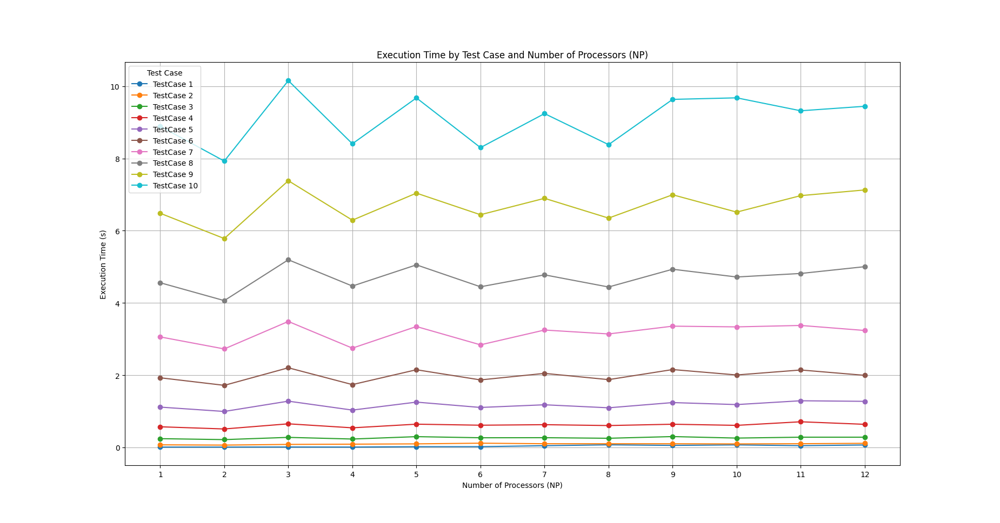

# Q1 Report on the MPI Implementation of the K-Nearest Neighbors Algorithm

## Problem Statement

The K-Nearest Neighbors (KNN) algorithm is a fundamental technique in machine learning and data mining used for classification and regression tasks. Given a set of points in a multi-dimensional space and a set of query points, the task is to find the K nearest neighbors for each query point. This involves calculating the Euclidean distance between each query point and all other points, then selecting the K closest ones.

In the context of parallel computing, the challenge is to efficiently handle large datasets by distributing the computation across multiple processes. This report covers the implementation of the KNN algorithm using the Message Passing Interface (MPI) to parallelize the computation across multiple processes, aiming to reduce execution time and handle larger datasets more effectively.

## Algorithm

The MPI-based K-Nearest Neighbors algorithm is implemented as follows:

1. **Initialization and Input Handling:**
   - **MPI Initialization:** Initialize MPI and determine the rank of the process and the total number of processes.
   - **File Input:** Read the dataset from an input file which includes the number of points, number of queries, and the number of neighbors to find. The points and queries are also read and stored.

2. **Broadcasting Data:**
   - **Data Broadcast:** Distribute the points' coordinates, query coordinates, and indices from the root process to all other processes using `MPI_Bcast`.

3. **Query Distribution and Local Computation:**
   - **Distribute Queries:** Each process is assigned a portion of the queries to handle. The number of queries per process is calculated and each process processes its assigned queries.
   - **K-Nearest Neighbors Calculation:** For each query, compute the Euclidean distance to all points. Use a min-heap (priority queue) to keep track of the K nearest neighbors. This involves inserting distances into the heap and maintaining its size to K, ensuring that only the K closest points are retained.

4. **Result Gathering:**
   - **Local Results:** Each process gathers its results in a local array.
   - **Gather Results:** Use `MPI_Gatherv` to gather the results from all processes to the root process. This involves sending data from all processes and combining them into a single result set.

5. **Timing and Cleanup:**
   - **Measure Time:** Calculate the execution time of the entire process.
   - **Cleanup:** Release allocated memory and finalize MPI.

## Time Complexity

The time complexity of the MPI-based KNN algorithm is as follows:

- **Single Process Complexity:**
  - **Distance Calculation:** \(O(N)\) per query, where \(N\) is the total number of points.
  - **Priority Queue Operations:** \(O(N \log K)\), where \(K\) is the number of nearest neighbors.
  - **Total Complexity for a Single Query:** \(O(N \log K)\).

  For \(Q\) queries, the complexity is \(O(Q \cdot N \log K)\).

- **Parallelized Complexity:**
  - **Distributing Queries:** Each process handles \(Q/P\) queries.
  - **Local Computations:** Each process performs \(O((Q/P) \cdot N \log K)\).
  - **Gathering Results:** The complexity for gathering results is \(O(Q \cdot N)\).

  Overall time complexity for \(P\) processes is approximately \(O((Q/P) \cdot N \log K + Q \cdot N)\).

## Message Complexity

Message complexity involves:

- **Broadcasting Data:** \(O(N + Q)\) for broadcasting points and queries.
- **Gathering Results:** \(O(Q \cdot K)\) for gathering results from all processes.

  Total message complexity is \(O(N + Q + Q \cdot K)\).

## Space Requirements

- **Per Process Memory:**
  - Arrays for points and queries: \(O(N + Q)\) floating-point numbers.
  - Local KNN results: \(O((Q/P) \cdot K)\) integers.
  
- **Global Memory:**
  - Memory for all points and queries: \(O(N + Q)\) floating-point numbers.
  - Memory for final results: \(O(Q \cdot K)\) integers.

  Total space complexity is approximately \(O(N + Q + Q \cdot K)\).

## Performance Scaling (1 to 12 Processes)



# Q3 Parallel Prefix Sum Using MPI

## Problem Statement

The objective of this program is to compute the prefix sum (cumulative sum) of a large array distributed across multiple processes using MPI (Message Passing Interface). The input array is read from a file, distributed among processes, and each process computes the local prefix sum. Finally, the program aggregates these results to produce the global prefix sum for the entire array.

## Implementation Details

1. **Initialization:**
   - The MPI environment is initialized.
   - The root process (rank 0) reads the input array from a file and broadcasts the size of the array (`N`) to all processes.

2. **Data Distribution:**
   - The input array is divided into chunks, with each process receiving a chunk of the array.
   - Each process computes the local prefix sum of its chunk.

3. **Prefix Sum Computation:**
   - Each process calculates the local prefix sum of its chunk.
   - The prefix sum results from each process are gathered at the root process.
   - The root process computes the global prefix sum by aggregating the results from all processes.
   - The global prefix sum is then broadcasted to all processes.

4. **Final Aggregation:**
   - Each process updates its local prefix sum based on the global prefix sum received from the root process.
   - The final results are gathered and printed by the root process.

## Time Complexity

The time complexity of the implementation can be analyzed as follows:

- **Local Prefix Sum Computation:** Each process computes the prefix sum of its local chunk in \(O(\text{chunk\_size})\) time.
- **Gathering Prefix Sum Results:** Gathering the local results at the root process involves \(O(\text{size})\) operations where \(\text{size}\) is the number of processes.
- **Global Prefix Sum Computation:** The root process computes the global prefix sum by performing \(O(\text{size})\) operations to aggregate the results.

Overall, the time complexity is \(O(N)\), where \(N\) is the total number of elements in the array.

## Space Complexity

The space complexity can be analyzed as follows:

- **Local Storage:** Each process requires space for its chunk of the array and the local prefix sum, resulting in \(O(\text{chunk\_size})\) space.
- **Global Storage:** The root process requires additional space to store the prefix sums gathered from all processes.

Overall, the space complexity is \(O(N + \text{size})\), where \(N\) is the total number of elements and \(\text{size}\) is the number of processes.

## Message Complexity

The message complexity of the approach is determined by:

- **Data Distribution:** Each process receives a chunk of the array from the root process, resulting in \(O(\text{size})\) messages for sending data.
- **Gathering Results:** Each process sends its local prefix sum to the root process, resulting in \(O(\text{size})\) messages.
- **Broadcasting Results:** The root process broadcasts the global prefix sum to all processes, resulting in \(O(\text{size})\) messages.

Overall, the message complexity is \(O(\text{size})\), where \(\text{size}\) is the number of processes.

## Running the Program

To run the program, compile it with an MPI compiler (e.g., `mpicxx`), and execute it using an MPI execution command (e.g., `mpirun` or `mpiexec`). Ensure that the input file `input.txt` is available in the working directory.

## Performance Scaling (1 to 12 Processes)



## Computational vs. Overhead Complexity

**Computational Complexity** measures the time or space an algorithm takes based on the size of the input, expressed in Big O notation (e.g., O(n), O(n^2)). It reflects how the algorithm scales with input size.

**Overhead Complexity** refers to the additional time or resources needed for tasks beyond the core computation, such as memory management, function calls, and I/O operations.

When overhead complexity is significant compared to computational complexity, it can dominate the execution time. For example, an algorithm with O(n) complexity might still be slower than another with similar complexity if it has high overhead due to frequent memory allocations or extensive function calls.

As input size increases, the impact of high overhead becomes more pronounced, often overshadowing the computational complexity. Therefore, optimizing both computational and overhead complexities is crucial for achieving better overall performance.


# Q5 Matrix Chain Multiplication with MPI

## Problem Statement

The matrix chain multiplication problem involves finding the most efficient way to multiply a given sequence of matrices. The goal is to minimize the total number of scalar multiplications required. Given a sequence of matrices with known dimensions, the challenge is to determine the optimal order of matrix multiplications.

## Approach

This project implements a parallel solution to the matrix chain multiplication problem using MPI (Message Passing Interface). The approach is outlined below:

### Initialization and Input Handling

1. **MPI Initialization:** 
   - `MPI_Init` initializes the MPI environment.

2. **Reading Input:**
   - The root process (rank 0) reads matrix dimensions from a file and broadcasts this information to all processes using `MPI_Bcast`.

### Matrix Chain Multiplication

1. **Dynamic Programming Table:**
   - A 2D vector `dp` is used to store the minimum number of multiplications needed for multiplying matrix subsequences.

2. **Parallel Processing:**
   - The work is divided based on `offset`, which determines the chain length.
   - Each MPI process calculates a portion of the `dp` table for a specific range of matrix subsequences.
   - Processes compute the minimal cost for their assigned subsequences and gather results at the root process.
   - Results are then broadcasted to all processes to update their local `dp` tables.

### Synchronization and Final Calculation

1. **Post-Processing:**
   - After computing the `dp` table in parallel, the root process performs any remaining computations if necessary.
   - The final result and execution time are outputted by the root process.

## Time Complexity

- **Sequential Part:** The `singleProcess` function has a time complexity of \(O(N^3)\), where \(N\) is the number of matrices.
- **Parallel Part:** The parallel computation also adheres to \(O(N^3)\), but execution time is reduced by dividing the work among multiple processes.

## Message Complexity

1. **Broadcasting:**
   - Matrix dimensions and size `N` are broadcasted to all processes using `MPI_Bcast`, with complexity \(O(\log P)\), where \(P\) is the number of processes.

2. **Gathering Results:**
   - Each process sends its computed results to the root process using `MPI_Gatherv`, with complexity \(O(N)\) in the worst case.

3. **Broadcasting Results:**
   - The updated `dp` table is broadcasted to all processes, involving another `MPI_Bcast` operation with complexity \(O(\log P)\).

## Space Requirements

1. **Matrix Dimensions:**
   - Requires \(O(N)\) space for `matric_dim`.

2. **Dynamic Programming Table:**
   - Requires \(O(N^2)\) space for the `dp` table.

3. **Auxiliary Storage:**
   - Each process needs space for local computations (`sendbuf` and `ans`), requiring \(O(N)\) space.
   - Additional space for MPI-related buffers and arrays (`counts` and `displacements`), which is \(O(P)\), where \(P\) is the number of processes.

**Total Space Complexity:** \(O(N^2)\) due to the primary storage being the `dp` table.


# Q4 Report: Julia Set Calculation with MPI

## Key Components


### Broadcasting Data

```cpp
MPI_Bcast(&n, 1, MPI_INT, 0, MPI_COMM_WORLD);
MPI_Bcast(&m, 1, MPI_INT, 0, MPI_COMM_WORLD);
MPI_Bcast(&k, 1, MPI_INT, 0, MPI_COMM_WORLD);
MPI_Bcast(&a, 1, MPI_FLOAT, 0, MPI_COMM_WORLD);
MPI_Bcast(&b, 1, MPI_FLOAT, 0, MPI_COMM_WORLD);
```

- **Description**: Distributes the dimensions and parameters from the root process to all other processes using `MPI_Bcast`.

### Distribution of Work

```cpp
int rows_per_process = n / world_size;
int remainder = n % world_size;
int start_row = world_rank * rows_per_process + std::min(world_rank, remainder);
int end_row = start_row + rows_per_process + (world_rank < remainder ? 1 : 0);
int local_rows = end_row - start_row;
```

- **Description**: Calculates the number of rows each process will handle. Handles cases where `n` is not perfectly divisible by the number of processes (`world_size`).

### Julia Set Computation

```cpp
for (int i = 0; i < local_rows; ++i) {
    for (int j = 0; j < m; ++j) {
        std::complex<float> z(x[j], y[start_row + i]);
        int count = 0;
        while (count < k + 3 && std::norm(z) <= 4) {
            z = z * z + std::complex<float>(a, b);
            count++;
        }
        local_matrix[i][j] = (count > k + 1) ? 1 : 0;
    }
}
```

- **Description**: Computes the Julia set for the local rows of the matrix. The Julia set is computed using the iterative formula and is stored in the local matrix.

### Gathering Results

```cpp
std::vector<int> recvcounts(world_size);
std::vector<int> displs(world_size);

for (int i = 0; i < world_size; ++i) {
    recvcounts[i] = (n / world_size + (i < remainder ? 1 : 0)) * m;
    displs[i] = (i * (n / world_size) + std::min(i, remainder)) * m;
}

std::vector<int> local_flattened(local_rows * m);
for (int i = 0; i < local_rows; ++i) {
    std::copy(local_matrix[i].begin(), local_matrix[i].end(), local_flattened.begin() + i * m);
}

std::vector<int> gathered_result;
if (world_rank == 0) {
    gathered_result.resize(n * m);
}

MPI_Gatherv(local_flattened.data(), local_rows * m, MPI_INT,
            gathered_result.data(), recvcounts.data(), displs.data(), MPI_INT,
            0, MPI_COMM_WORLD);
```

- **Description**: Collects the results from all processes and assembles them into a single matrix on the root process using `MPI_Gatherv`.

Let's break down the time complexity, message complexity, and space requirements of the given MPI-based Julia set computation program.
### Time Complexity

The code computes the Julia set for an \( n \times m \) grid of points. The main computational task involves a nested loop to determine if each point belongs to the Julia set.

1. **Initialization and File I/O**:
    - **File I/O**: Constant-time operation with respect to grid size.
    - **Broadcasting**: Time complexity is \( O(\log P) \), where \( P \) is the number of processes. This is negligible compared to the computational complexity.

2. **Main Computation**:
    - Each point in the grid requires at most \( O(k) \) iterations to check if it belongs to the Julia set, where \( k \) is the maximum iteration count.
    - Each process handles \( \frac{n}{P} \times m \) points, so the time complexity per process is \( O\left(\frac{n}{P} \times m \times k\right) \).
    - Total time complexity across all processes is \( O(n \times m \times k) \).

3. **Gathering Results**:
    - The `MPI_Gatherv` operation involves gathering \( O(n \times m) \) data from all processes. This operation does not change the overall time complexity.

### Total Time Complexity: 
**\( O(n \times m \times k) \)**

### Message Complexity

1. **Broadcasting**:
    - Broadcasting parameters requires \( O(\log P) \) messages.

2. **Gathering**:
    - The `MPI_Gatherv` operation requires \( O(P) \) messages, with each message containing \( O\left(\frac{n \times m}{P}\right) \) elements.

### Total Message Complexity: 
**\( O(P) \)** messages for gathering and **\( O(\log P) \)** for broadcasting.

### Space Requirements

1. **Local Memory**:
    - Each process allocates memory for \( \frac{n}{P} \times m \) elements. Thus, per process space requirement is \( O\left(\frac{n \times m}{P}\right) \).

2. **Gathered Results (Root Process Only)**:
    - The root process requires space for the entire \( n \times m \) grid. Thus, the space complexity on the root process is \( O(n \times m) \).

### Total Space Complexity:
- **Per Process**: \( O\left(\frac{n \times m}{P}\right) \).
- **Root Process**: \( O(n \times m) \).

### Summary:
- **Time Complexity**: \( O(n \times m \times k) \).
- **Message Complexity**: \( O(P) \) for gathering, \( O(\log P) \) for broadcasting.
- **Space Complexity**: \( O\left(\frac{n \times m}{P}\right) \) per process, \( O(n \times m) \) on the root process.
### RESULTS
from the below results we can see that as number of processes increasing due to communication overhead the time is increasing(in 100s) in lower Ns signifactly , but as you go on increasing the N to 10000 , we can see there the minimum differnt in the communication overhead.Necessarily for the very big N~100000 we see there computation is heavier than that of communication so the higher the number of processes.But we observe the trend where for 2 processes the time is optimum.This the sweet spot where the communication overhead is very less and efficient parallelisation is done.

| Group | Item | Value     |
|-------|------|-----------|
| 1     | 1    | 0.418399  |
| 1     | 2    | 0.271621  |
| 1     | 3    | 0.530665  |
| 1     | 4    | 0.432962  |
| 1     | 5    | 0.556229  |
| 1     | 6    | 0.486830  |
| 1     | 7    | 0.428529  |
| 1     | 8    | 0.466052  |
| 1     | 9    | 0.502719  |
| 1     | 10   | 0.483175  |
| 1     | 11   | 0.489395  |
| 1     | 12   | 0.460729  |
| 2     | 1    | 1.672469  |
| 2     | 2    | 1.084312  |
| 2     | 3    | 1.944141  |
| 2     | 4    | 1.743174  |
| 2     | 5    | 2.074971  |
| 2     | 6    | 1.952832  |
| 2     | 7    | 2.068818  |
| 2     | 8    | 1.929439  |
| 2     | 9    | 1.905748  |
| 2     | 10   | 1.901101  |
| 2     | 11   | 1.959889  |
| 2     | 12   | 1.949509  |
| 3     | 1    | 3.762579  |
| 3     | 2    | 2.484539  |
| 3     | 3    | 4.097256  |
| 3     | 4    | 3.860489  |
| 3     | 5    | 4.652269  |
| 3     | 6    | 4.379219  |
| 3     | 7    | 4.713424  |
| 3     | 8    | 4.339425  |
| 3     | 9    | 4.583908  |
| 3     | 10   | 4.381725  |
| 3     | 11   | 4.533711  |
| 3     | 12   | 4.427797  |
| 4     | 1    | 6.709179  |
| 4     | 2    | 4.346900  |
| 4     | 3    | 7.968688  |
| 4     | 4    | 7.007444  |
| 4     | 5    | 8.268361  |
| 4     | 6    | 7.629407  |
| 4     | 7    | 8.428111  |
| 4     | 8    | 7.721466  |
| 4     | 9    | 8.266927  |
| 4     | 10   | 7.872602  |
| 4     | 11   | 7.951818  |
| 4     | 12   | 8.187583  |
| 5     | 1    | 10.439870 |
| 5     | 2    | 6.790893  |
| 5     | 3    | 12.512330 |
| 5     | 4    | 10.732692 |
| 5     | 5    | 13.221910 |
| 5     | 6    | 12.120233 |
| 5     | 7    | 13.153631 |
| 5     | 8    | 12.063286 |
| 5     | 9    | 12.330760 |
| 5     | 10   | 12.307764 |
| 5     | 11   | 12.302895 |
| 5     | 12   | 12.371549 |
| 6     | 1    | 15.047542 |
| 6     | 2    | 9.783156  |
| 6     | 3    | 16.607919 |
| 6     | 4    | 15.422435 |
| 6     | 5    | 18.966136 |
| 6     | 6    | 17.366866 |
| 6     | 7    | 18.840645 |
| 6     | 8    | 17.216053 |
| 6     | 9    | 17.870908 |
| 6     | 10   | 17.765248 |
| 6     | 11   | 17.883103 |
| 6     | 12   | 17.714719 |
| 7     | 1    | 20.549823 |
| 7     | 2    | 13.315444 |
| 7     | 3    | 25.130237 |
| 7     | 4    | 21.028130 |
| 7     | 5    | 25.627594 |
| 7     | 6    | 23.765100 |
| 7     | 7    | 25.773281 |
| 7     | 8    | 23.667072 |
| 7     | 9    | 25.204430 |
| 7     | 10   | 24.077170 |
| 7     | 11   | 23.214946 |
| 7     | 12   | 23.964617 |
| 8     | 1    | 26.721856 |
| 8     | 2    | 17.386029 |
| 8     | 3    | 31.289020 |
| 8     | 4    | 27.413314 |
| 8     | 5    | 33.695078 |
| 8     | 6    | 31.180747 |
| 8     | 7    | 33.023521 |
| 8     | 8    | 30.882872 |
| 8     | 9    | 31.324458 |
| 8     | 10   | 31.263512 |
| 8     | 11   | 32.057683 |
| 8     | 12   | 30.783369 |
| 9     | 1    | 33.835550 |
| 9     | 2    | 22.014147 |
| 9     | 3    | 40.542649 |
| 9     | 4    | 34.714486 |
| 9     | 5    | 42.831312 |
| 9     | 6    | 39.453186 |
| 9     | 7    | 42.634636 |
| 9     | 8    | 39.257146 |
| 9     | 9    | 40.746743 |
| 9     | 10   | 39.988665 |
| 9     | 11   | 39.358910 |
| 9     | 12   | 39.100902 |
| 10    | 1    | 41.746663 |
| 10    | 2    | 27.175386 |
| 10    | 3    | 48.830116 |
| 10    | 4    | 43.358064 |
| 10    | 5    | 53.085431 |
| 10    | 6    | 48.718575 |
| 10    | 7    | 52.993408 |
| 10    | 8    | 48.272170 |
| 10    | 9    | 51.000888 |
| 10    | 10   | 47.486321 |
| 10    | 11   | 49.184575 |
| 10    | 12   | 50.080222 |


## Summary

The program efficiently calculates the Julia set using MPI by distributing the computation across multiple processes. The key steps include broadcasting input data, computing the Julia set locally, and then gathering the results on the root process. This approach leverages parallelism to handle large-scale computations more efficiently. The time complexity is mainly influenced by the number of iterations for each point and the size of the matrix, while the message complexity involves broadcasting and gathering data across processes.


## Report on MPI-Based Matrix Inversion Program

### Overview

The MPI-based program is designed to perform matrix inversion using parallel processing. 

### Program Approach

The program implements the inversion of a matrix using Gaussian Elimination with partial pivoting in a distributed manner. The matrix inversion process involves several key steps, which are parallelized across multiple MPI processes. 

#### 1. Initialization and Matrix Distribution

The program starts by initializing MPI and reading the matrix from a file. The matrix is then distributed among the available MPI processes using scatter

```cpp
void distribute_matrix(const std::vector<float>& A_flat, std::vector<float>& local_A_flat, 
                       int N, int world_size, int world_rank, 
                       std::vector<int>& send_counts, std::vector<int>& displs) {
    // Determine the number of rows each process will handle
    int rows_per_process = N / world_size;
    int remainder = N % world_size;

    // Calculate send counts and displacements
    for (int i = 0; i < world_size; ++i) {
        send_counts[i] = (rows_per_process + (i < remainder ? 1 : 0)) * N;
        displs[i] = (i > 0) ? displs[i-1] + send_counts[i-1] : 0;
    }

    int local_rows = send_counts[world_rank] / N;
    local_A_flat.resize(local_rows * N);

    // Scatter matrix data to all processes
    MPI_Scatterv(A_flat.data(), send_counts.data(), displs.data(), MPI_FLOAT,
                 local_A_flat.data(), local_rows * N, MPI_FLOAT, 0, MPI_COMM_WORLD);
}
```

In this snippet, the matrix `A_flat` is scattered among the processes using `MPI_Scatterv`. Each process receives a chunk of the matrix corresponding to its rank.It also inherently takes care of remainder rows.

#### 2. Pivoting and Gaussian Elimination

The core of the matrix inversion involves pivoting and Gaussian elimination. Each process handles a portion of the matrix and updates it according to the pivoting information along with that it handles swapping of 'zero' placed elements in diagonals. 

```cpp
void performPivotUpdate(
    std::vector<float>& local_A_flat,
    std::vector<float>& local_I_flat,
    std::vector<float>& pivot_row_A,
    std::vector<float>& pivot_row_I,
    int i, int start, int end, int N, int rows)
{
    // Normalize the pivot row
    float pivot = pivot_row_A[i];
    for (int j = 0; j < N; j++) {
        pivot_row_I[j] /= pivot;
        pivot_row_A[j] /= pivot;
    }

    // Update the matrix rows
    for (int local_row = 0; local_row < rows; local_row++) {
        float factor = local_A_flat[local_row * N + i];
        if (local_row == i - start) {
            continue;
        }
        for (int j = 0; j < N; j++) {
            local_I_flat[local_row * N + j] -= factor * pivot_row_I[j];
            local_A_flat[local_row * N + j] -= factor * pivot_row_A[j];
        }
    }

    // Update local matrices if within range
    if (i >= start && i < end) {
        int local_pivot_row = i - start;
        std::copy(pivot_row_A.begin(), pivot_row_A.end(), 
                  local_A_flat.begin() + local_pivot_row * N);
        std::copy(pivot_row_I.begin(), pivot_row_I.end(), 
                  local_I_flat.begin() + local_pivot_row * N);
    }
}
```

In this function, the pivot row is normalized, and the matrix rows are updated accordingly. This function is called iteratively for each pivot.

#### 3. Gathering Results

After processing, each process contributes its portion of the inverted matrix, which is then gathered at the root process.

```cpp
void gather_result(const std::vector<float>& local_I_flat, std::vector<float>& I_flat, 
                   int N, int world_size, int world_rank, 
                   const std::vector<int>& send_counts, const std::vector<int>& displs) {
    if (world_rank == 0) {
        I_flat.resize(N * N);
    }
    MPI_Gatherv(local_I_flat.data(), send_counts[world_rank], MPI_FLOAT,
                I_flat.data(), send_counts.data(), displs.data(), MPI_FLOAT,
                0, MPI_COMM_WORLD);
}
```

`MPI_Gatherv` is used to collect the partial results from all processes and assemble the final inverted matrix.

Here's a detailed analysis of your MPI-based matrix computation program, focusing on time complexity, message complexity, and space requirements:

## Time Complexity

1. **File Reading and Initialization**:
   - **File Reading**: Only the root process reads the file and initializes the matrix \( A \). This operation is \( O(N^2) \) as it involves reading all \( N \times N \) elements.
   - **Initialization**: Broadcasting the size \( N \) and initializing identity matrix \( I \) is done in \( O(N^2) \) time by the root process.

2. **Distribution of Matrix**:
   - **Distribution**: The `distribute_matrix` function scatters rows of matrix \( A \) among processes. The complexity is \( O(N^2) \) for scattering the entire matrix.

3. **Pivot Search and Update**:
   - **Pivot Search**: Each process searches for a valid pivot row in its local portion of the matrix. This operation involves scanning a portion of matrix \( A \), which is \( O(N^2 / P) \) for each process. The global search for the pivot and broadcasting operations can also be considered as \( O(N^2) \) since each process contributes to finding and broadcasting pivot information.
   - **Pivot Update**: Updating the matrix involves iterating over rows and columns. For each row \( i \), the updates involve scanning and modifying matrix rows which is \( O(N^2) \) in total across all processes, considering that each row \( i \) is updated in all \( N \) columns.

4. **Gathering Results**:
   - **Gathering Results**: Collecting results from all processes involves gathering the entire \( N \times N \) matrix, which is \( O(N^2) \) for the root process.

5. **Overall Time Complexity**:
   - The most time-consuming operation is the pivot search and matrix update, which is \( O(N^2) \). Thus, the overall time complexity of the program is:
   - **Total Time Complexity**: \( O(N^2) \).

## Message Complexity

1. **Broadcasting Parameters**:
   - **Broadcasting \( N \)**: Broadcasting the integer \( N \) takes \( O(\log P) \) messages where \( P \) is the number of processes.
   - **Broadcasting Send Counts**: Broadcasting the array of send counts involves \( O(\log P) \) messages.

2. **Gathering Matrix Results**:
   - **Gathering Results**: The `MPI_Gatherv` operation involves sending and receiving \( O(N^2) \) elements. Each process sends its portion of the matrix and the root collects these. The total message complexity is \( O(P) \) messages as each process contributes to gathering.

3. **Pivot Row Broadcast**:
   - **Pivot Row Data**: Broadcasting pivot row data involves sending \( O(N) \) elements per broadcast. Each pivot row is broadcasted potentially multiple times, but the number of broadcasts per row is proportional to \( O(N) \).

4. **Overall Message Complexity**:
   - Considering broadcasting parameters and gathering results, the total message complexity is:
   - **Total Message Complexity**: \( O(P) \) for gathering and \( O(\log P) \) for broadcasting parameters and pivot rows.

## Space Requirements

1. **Local Memory**:
   - **Local Matrices**: Each process requires space for its portion of matrix \( A \) and the identity matrix \( I \). This is \( O(N^2 / P) \) for matrix \( A \) and \( O(N^2 / P) \) for the identity matrix.

2. **Gathered Results**:
   - **Root Process**: The root process needs to store the entire \( N \times N \) matrix \( I \) after gathering results. This requires \( O(N^2) \) space.

3. **Overall Space Complexity**:
   - **Per Process**: \( O(N^2 / P) \) for local matrices.
   - **Root Process**: \( O(N^2) \) for storing the gathered results.

### Summary

- **Time Complexity**: \( O(N^2) \)
- **Message Complexity**: \( O(P) \) for gathering, \( O(\log P) \) for broadcasting parameters and pivot rows.
- **Space Complexity**: \( O(N^2 / P) \) per process, \( O(N^2) \) on the root process.


### RESULTS


from the below results we can see that as number of processes increasing due to communication overhead the time is increasing(in 100s) in lower Ns signifactly , but as you go on increasing the N to 1000 , we can see there the minimum differnt in the communication overhead.Necessarily for the very big N~100000 we see there computation is heavier than that of communication so the higher the number of processes , the faster the work and when number of processes is 3 and 9 you observe a increase in time due to communication overhead.
for example observe the result :
20000 as N

time for different number of processes is:


| TestCase | NP | ExecutionTime |
|----------|----|---------------|
| 1        | 1  | 0.00911795    |
| 1        | 2  | 0.00929846    |
| 1        | 3  | 0.0113691     |
| 1        | 4  | 0.00956921    |
| 1        | 5  | 0.0203003     |
| 1        | 6  | 0.0215014     |
| 1        | 7  | 0.0472417     |
| 1        | 8  | 0.0722779     |
| 1        | 9  | 0.0560332     |
| 1        | 10 | 0.0705115     |
| 1        | 11 | 0.0482363     |
| 1        | 12 | 0.0678014     |
| 2        | 1  | 0.0720526     |
| 2        | 2  | 0.0643712     |
| 2        | 3  | 0.0832212     |
| 2        | 4  | 0.0899015     |
| 2        | 5  | 0.0981486     |
| 2        | 6  | 0.117177      |
| 2        | 7  | 0.101799      |
| 2        | 8  | 0.101502      |
| 2        | 9  | 0.101245      |
| 2        | 10 | 0.0968873     |
| 2        | 11 | 0.102456      |
| 2        | 12 | 0.113617      |
| 3        | 1  | 0.242361      |
| 3        | 2  | 0.216087      |
| 3        | 3  | 0.277964      |
| 3        | 4  | 0.232188      |
| 3        | 5  | 0.298215      |
| 3        | 6  | 0.267202      |
| 3        | 7  | 0.269265      |
| 3        | 8  | 0.253226      |
| 3        | 9  | 0.300194      |
| 3        | 10 | 0.258496      |
| 3        | 11 | 0.28316       |
| 3        | 12 | 0.282979      |
| 4        | 1  | 0.571234      |
| 4        | 2  | 0.510924      |
| 4        | 3  | 0.65321       |
| 4        | 4  | 0.542386      |
| 4        | 5  | 0.643458      |
| 4        | 6  | 0.61481       |
| 4        | 7  | 0.629373      |
| 4        | 8  | 0.605376      |
| 4        | 9  | 0.641905      |
| 4        | 10 | 0.610686      |
| 4        | 11 | 0.709969      |
| 4        | 12 | 0.639346      |
| 5        | 1  | 1.11579       |
| 5        | 2  | 0.995582      |
| 5        | 3  | 1.28054       |
| 5        | 4  | 1.03351       |
| 5        | 5  | 1.2541        |
| 5        | 6  | 1.10631       |
| 5        | 7  | 1.18042       |
| 5        | 8  | 1.09672       |
| 5        | 9  | 1.24129       |
| 5        | 10 | 1.18589       |
| 5        | 11 | 1.2917        |
| 5        | 12 | 1.27566       |
| 6        | 1  | 1.92776       |
| 6        | 2  | 1.71841       |
| 6        | 3  | 2.20434       |
| 6        | 4  | 1.73921       |
| 6        | 5  | 2.1502        |
| 6        | 6  | 1.86877       |
| 6        | 7  | 2.04969       |
| 6        | 8  | 1.87662       |
| 6        | 9  | 2.1554        |
| 6        | 10 | 2.00583       |
| 6        | 11 | 2.14361       |
| 6        | 12 | 1.99557       |
| 7        | 1  | 3.059         |
| 7        | 2  | 2.72644       |
| 7        | 3  | 3.48712       |
| 7        | 4  | 2.74862       |
| 7        | 5  | 3.34638       |
| 7        | 6  | 2.83995       |
| 7        | 7  | 3.24953       |
| 7        | 8  | 3.1413        |
| 7        | 9  | 3.35661       |
| 7        | 10 | 3.33712       |
| 7        | 11 | 3.3766        |
| 7        | 12 | 3.23739       |
| 8        | 1  | 4.55852       |
| 8        | 2  | 4.06425       |
| 8        | 3  | 5.19486       |
| 8        | 4  | 4.46715       |
| 8        | 5  | 5.05373       |
| 8        | 6  | 4.4469        |
| 8        | 7  | 4.77729       |
| 8        | 8  | 4.44104       |
| 8        | 9  | 4.93264       |
| 8        | 10 | 4.71814       |
| 8        | 11 | 4.81565       |
| 8        | 12 | 5.00384       |
| 9        | 1  | 6.48202       |
| 9        | 2  | 5.78262       |
| 9        | 3  | 7.38394       |
| 9        | 4  | 6.2909        |
| 9        | 5  | 7.03978       |
| 9        | 6  | 6.44185       |
| 9        | 7  | 6.89576       |
| 9        | 8  | 6.34826       |
| 9        | 9  | 6.99422       |
| 9        | 10 | 6.51416       |
| 9        | 11 | 6.97038       |
| 9        | 12 | 7.12794       |
| 10       | 1  | 8.88973       |
| 10       | 2  | 7.92717       |
| 10       | 3  | 10.1546       |
| 10       | 4  | 8.40603       |
| 10       | 5  | 9.67583       |
| 10       | 6  | 8.30027       |
| 10       | 7  | 9.24128       |
| 10       | 8  | 8.3821        |
| 10       | 9  | 9.63501       |
| 10       | 10 | 9.67777       |
| 10       | 11 | 9.31951       |
| 10       | 12 | 9.44377       |





### Summary

The provided MPI-based matrix inversion program leverages parallel processing to efficiently handle large matrices. By distributing matrix rows and performing Gaussian elimination with partial pivoting in parallel, the program achieves reduced computation time compared to a sequential approach. The time and message complexities are well-aligned with the matrix size and number of MPI processes, ensuring scalability and efficiency.


